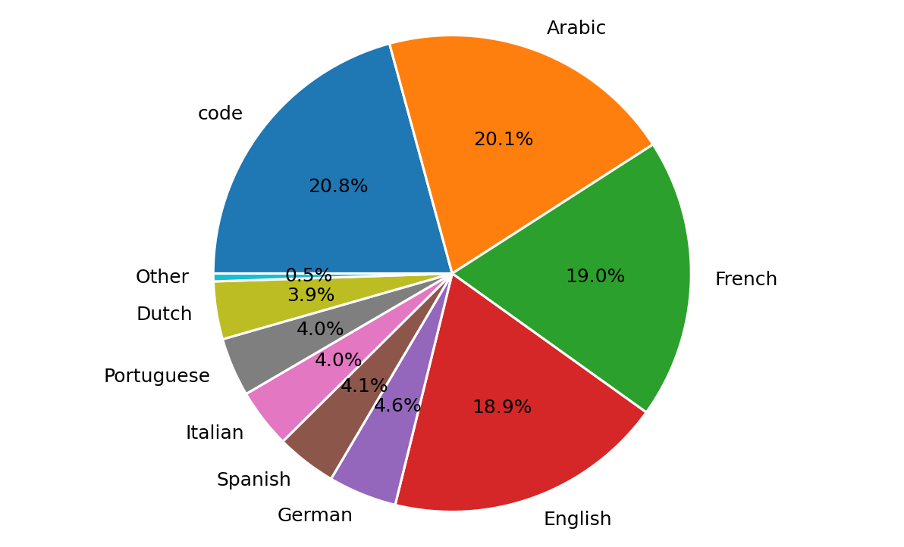
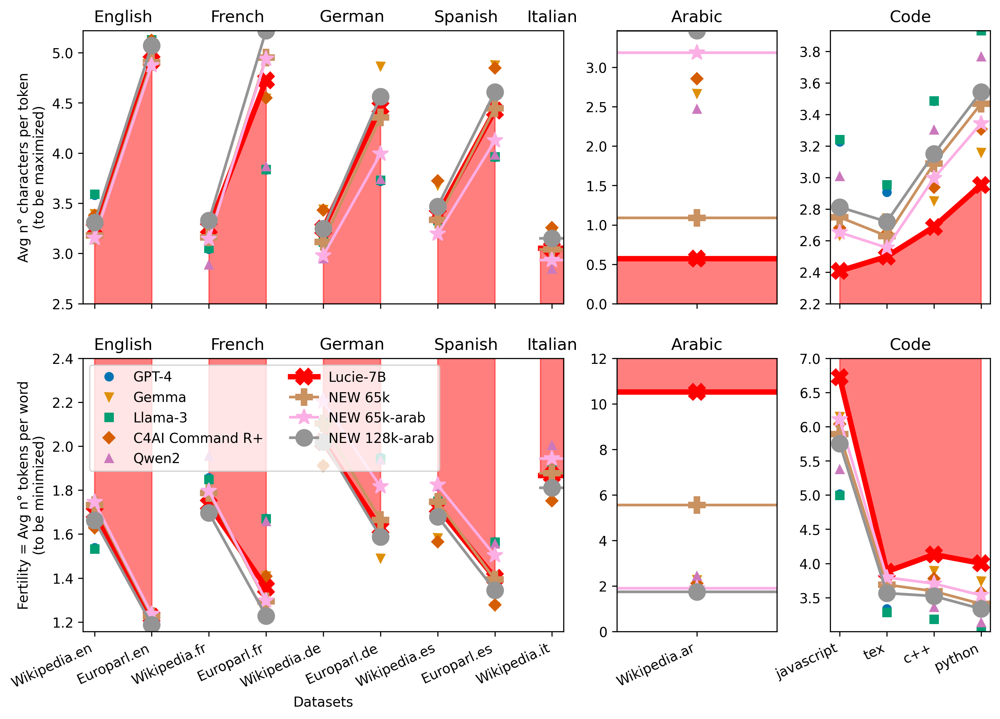
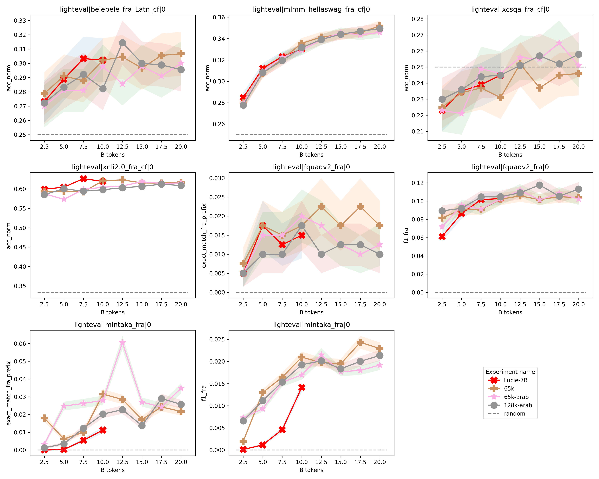

# Tokenizer Training Chronicles

Several tokenizers were trained, with different sizes (65k and 128k), and including or not Arabic data in the training set. 

There were three sources of training data:
1. **FineWeb-Edu**: A large English dataset, mainly focused on educational content.
2. **FineWeb-2**: A multilingual dataset, including French, Arabic, German, Dutch, Italian, Spanish, Portuguese, regional languages and dialects, and some Creole languages.
3. **StarCoder**: A large code dataset.

Each source was randomly subsampled to create a balanced training set across languages, with a focus on French, English and Arabic.
The following table summarizes all the training data used:
| language                   | source      | # docs   | # words   | # chars   |
|:---------------------------|:------------|:---------|:----------|:----------|
| code                       | [StarCoder](https://huggingface.co/datasets/bigcode/starcoderdata)   | 1.53 M   | 572.41 M  | 5.82 B    |
| Arabic                     | [FineWeb-2](https://huggingface.co/datasets/HuggingFaceFW/fineweb-2)   | 1.99 M   | 956.43 M  | 5.64 B    |
| French                     | FineWeb-2   | 1.69 M   | 859.02 M  | 5.32 B    |
| English                    | [FineWeb-Edu](https://huggingface.co/datasets/HuggingFaceFW/fineweb-edu) | 1.11 M   | 860.09 M  | 5.30 B    |
| German                     | FineWeb-2   | 404.80 K | 182.32 M  | 1.30 B    |
| Spanish                    | FineWeb-2   | 358.20 K | 188.09 M  | 1.14 B    |
| Italian                    | FineWeb-2   | 358.56 K | 174.60 M  | 1.13 B    |
| Portuguese                 | FineWeb-2   | 375.50 K | 181.23 M  | 1.12 B    |
| Dutch                      | FineWeb-2   | 410.62 K | 174.32 M  | 1.10 B    |
| Basque                     | FineWeb-2   | 45.11 K  | 16.32 M   | 127.31 M  |
| Occitan                    | FineWeb-2   | 1.03 K   | 475.13 K  | 2.84 M    |
| Corsican                   | FineWeb-2   | 737      | 463.97 K  | 2.73 M    |
| Catalan                    | FineWeb-2   | 971      | 388.03 K  | 2.34 M    |
| Saint Lucian Creole French | FineWeb-2   | 1.05 K   | 418.69 K  | 2.18 M    |
| Réunion Creole French      | FineWeb-2   | 1.72 K   | 444.16 K  | 2.11 M    |
| Breton                     | FineWeb-2   | 1.07 K   | 385.88 K  | 2.10 M    |
| Guadeloupean Creole French | FineWeb-2   | 1.03 K   | 399.46 K  | 2.04 M    |
| Tahitian                   | FineWeb-2   | 393      | 440.30 K  | 1.99 M    |
| Picard                     | FineWeb-2   | 1.19 K   | 306.08 K  | 1.72 M    |
| Seselwa Creole French      | FineWeb-2   | 89       | 299.35 K  | 1.59 M    |
| Guianese Creole French     | FineWeb-2   | 6        | 840       | 4.91 K    |

The dataset distribution, when including all data (with Arabic and regional languages), is as follows:

Compression performances are the following:

Ablation studies were performed to assess the impact of different training data sources and sizes on the learning curves, when training on up to 20B tokens of French data (from FineWeb-2 dataset).
The following results show that the size of the tokenizer and the inclusion of Arabic data have little impact on performance, at least at the beginning of the training.
