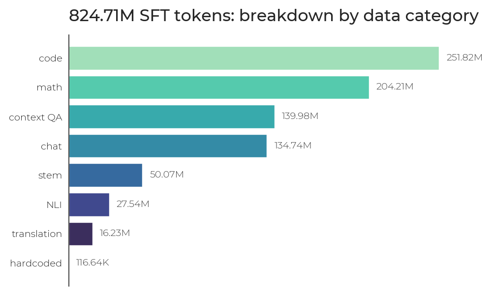

# Model Card for Luciole-1B-SFT-1.1

* [Model Description](#model-description)
<!-- * [Uses](#uses) -->
* [Bias, Risks, and Limitations](#bias-risks-and-limitations)
  * [Recommendations](#recommendations)
* [Training Details](#training-details)
  * [Training Data](#training-data)
  * [Preprocessing](#preprocessing)
  * [Instruction template](#instruction-template)
  * [Training Procedure](#training-procedure)
<!-- * [Evaluation](#evaluation) -->
* [Testing the model](#testing-the-model)
  * [Test with ollama](#test-with-ollama)
  * [Test with vLLM](#test-with-vllm)
* [Citation](#citation)
* [Acknowledgements](#acknowledgements)
* [Contact](#contact)

## Model Description

Luciole-1B-SFT-1.1 is a fine-tuned version of [OpenLLM-France/Luciole-1B-Base](https://huggingface.co/OpenLLM-France/Luciole-1B-Base), an open-source, multilingual causal language model created by OpenLLM-France. Luciole-1B-SFT-1.1  was developed by [LINAGORA](https://labs.linagora.com/) and the [OpenLLM-France](https://openllm-france.fr/) consortium as a part of the OpenLLM France project, funded by [BPI France](https://www.bpifrance.fr/) through the [France 2030](https://www.info.gouv.fr/grand-dossier/france-2030) program.

Luciole-1B-SFT-1.1 is fine-tuned on a mixture of human-templated and synthetic instructions and a small set of customized prompts about OpenLLM and Luciole. Its training data covers topics in math, science, coding, and translation. 

Note that Luciole-1B-SFT-1.1 has only undergone a stage of supervised fine-tuning (SFT) on instructions; it has not been aligned to conform to human preferences. Its primary intended functions include facilitating testing of the base model and serving as a step in a more complex training pipeline that requires an SFT-trained model (such as a pipeline involving DPO or RLHF).  

Development of the Luciole models is an active, ongoing project. In the spirit of open-source, we share the model weights and training recipes to shed light on the different steps of the training process. If you are interested in contributing to the Luciole project, contact us at contact@openllm-france.fr. 

* License: [Apache 2.0](https://www.apache.org/licenses/LICENSE-2.0)
<!-- * Training repository: -->
* Technical report: coming soon.


## Bias, Risks, and Limitations
Luciole-1B-SFT-1.1 has not been aligned to conform to human preferences. The model 
would need further training before being implemented in pipelines for specific use-cases or for particular generation tasks such as code generation or mathematical problem solving. It is also susceptible to hallucinations; that is, producing false answers that result from its training on massive amounts of diverse text. Its performance and accuracy can be improved through further fine-tuning and alignment with methods such as DPO, RLHF, etc.

Luciole-1B-SFT-1.1 was trained on a significantly higher proportion of English data than its base model: it was trained on a roughly 5 to 1 ratio of English to French, whereas [OpenLLM-France/Luciole-1B-Base](https://huggingface.co/OpenLLM-France/Luciole-1B-Base) was trained on 45% English, 30% French and 25% other languages. Future post-trained versions of Luciole-1B-Base will include higher proportions of French data.

Due to its size, Luciole-1B-SFT-1.1 is limited in the information that it can memorize; its ability to produce correct answers could be improved by implementing the model in a retrieval augmented generation pipeline.

Finally, while its base model, [OpenLLM-France/Luciole-1B-Base](https://huggingface.co/OpenLLM-France/Luciole-1B-Base), was trained on sequences of 131,072 tokens,  Luciole-1B-SFT-1.1 was trained on sequences of 16,384. Based on RULER evaluations, Luciole-1B-SFT-1.1 has a context window size of TO_BE_FILLED ⚠️  tokens. This window could be increased by fine-tuning on longer data samples.  

### Recommendations
* Further train Luciole-1B-SFT-1.1 with methods such as DPO, RLHF, etc. to align its behavior with desired outputs.
* Integrate the model in a RAG pipeline to augment its knowledge base.
* Extend training with longer sequences to increase context length.


## Training details

### Training data

⚠️
Luciole-1B-SFT-1.1 is trained on the following datasets:
* [Nemotron-Instruction-Following-Chat-v1](https://huggingface.co/datasets/nvidia/Nemotron-Instruction-Following-Chat-v1) (English; 65K samples)
* [Nemotron-Post-Training-Dataset-v2, math](https://huggingface.co/datasets/nvidia/Nemotron-Post-Training-Dataset-v2) (English; 180K samples)
* [Nemotron-Post-Training-Dataset-v2, stem](https://huggingface.co/datasets/nvidia/Nemotron-Post-Training-Dataset-v2) (English; 100K samples)
* [Nemotron-Post-Training-Dataset-v2, code](https://huggingface.co/datasets/nvidia/Nemotron-Post-Training-Dataset-v2) (English; 180K samples)
* [Nemotron-Post-Training-Dataset-v2, multilingual math](https://huggingface.co/datasets/nvidia/Nemotron-Post-Training-Dataset-v2) (French; 80K samples)
* [Dolci-Instruct-SFT, python algorithms](https://huggingface.co/datasets/allenai/Dolci-Instruct-SFT) (English; 100K samples)
* [FLAN v2 Converted](https://huggingface.co/datasets/ai2-adapt-dev/flan_v2_converted) (English, 80K samples)
* [PleIAs SYNTH](https://huggingface.co/datasets/PleIAs/SYNTH) (French; 150K samples)
* [smoltalk, smolsummarize](https://huggingface.co/datasets/HuggingFaceTB/smoltalk) (English; 35K samples)
* [smoltalk, smolrewrite](https://huggingface.co/datasets/HuggingFaceTB/smoltalk) (English; 15K samples)
* [smoltalk, explore-instruct-rewriting](https://huggingface.co/datasets/HuggingFaceTB/smoltalk) (English; 65K samples)
* [smoltalk, everyday-conversations](https://huggingface.co/datasets/HuggingFaceTB/smoltalk) (English; 2K samples)
* [smoltalk, systemchats](https://huggingface.co/datasets/HuggingFaceTB/smoltalk) (English; 33K samples)
* [Croissant-Aligned-Instruct](https://huggingface.co/datasets/OpenLLM-France/Croissant-Aligned-Instruct) (English/French; 24K)
* [Paradocs](https://huggingface.co/datasets/jhu-clsp/paradocs) (English/French; 65K samples)
* [EuroparlAligned]() (English/French; 6K samples)
* [ContextQA_hotpot_QA]()⚠️ (English; 74,393 samples)
* [ContextQA_TAT_QA]()⚠️ (English; 6K samples)
* Hard-coded prompts concerning OpenLLM and Lucie (based on [allenai/tulu-3-hard-coded-10x](https://huggingface.co/datasets/allenai/tulu-3-hard-coded-10x))
    * French: hardcoded_fr.jsonl (962 samples)
    * English: hardcoded_en.jsonl (1108 samples)

Four epochs were passed on each dataset.

<center>
   
</center>
    
### Preprocessing
* Filtering by keyword and foreign language strings: we [remove examples](https://github.com/OpenLLM-France/Luciole-Training/blob/main/data/processing/posttraining/preprocess.py) in which the assistant is presented as model other than Luciole (e.g., ChatGPT, Gemma, Llama, ...) as well as those in which there are strings of non-roman characters (signaling the presence of Arabic, Russian or Chinese text).

### Instruction template:
Luciole-1B-SFT-1.1 was trained on the chat template inspired from [Qwen3-1.7B](https://huggingface.co/Qwen/Qwen3-1.7B/). In our chat template, we removed thinking capability and added a default system prompt. The resulting template can be found [here](https://huggingface.co/OpenLLM-France/Luciole-1B-Instruct-1.1/blob/main/chat_template.jinja).


An example: 
```
from transformers import AutoTokenizer
tokenizer = AutoTokenizer.from_pretrained("OpenLLM-France/Luciole-1B-SFT-1.1")
chat = [
  {
    "content": "Qui était Molière ?",
    "role": "user"
  },
  {
    "content": "Molière était un dramaturge, acteur et comédien français du XVIIe siècle.",
    "role": "assistant"
  },
  {
    "content": "Quelles sont ses œuvres les plus connues ?",
    "role": "user"
  }
]
print(tokenizer.apply_chat_template(chat, tokenize=False, add_generation_prompt=True))
```
gives the output
```
<|im_start|>system
You are a helpful AI assistant named Luciole, trained by LINAGORA and OpenLLM France.<|im_end|>
<|im_start|>user
Qui était Molière ?<|im_end|>
<|im_start|>assistant
Molière était un dramaturge, acteur et comédien français du XVIIe siècle.<|im_end|>
<|im_start|>user
Quelles sont ses œuvres les plus connues ?<|im_end|>
<|im_start|>assistant
```

### Training procedure

The model architecture and hyperparameters are:
* context length: 16384<sup>*</sup>
* batch size: 256
* max learning rate: 3e-5
* min learning rate: 3e-6

<sup>*</sup>As noted above, while Luciole-1B-SFT-1.1 is trained on sequences of 16384 tokens, it maintains the capacity of the base model, [OpenLLM-France/Luciole-1B-Base](https://huggingface.co/OpenLLM-France/Luciole-1B-Base), to handle context sizes of up to 131K tokens.

## Testing the model

### Test with ollama

* Download and install [Ollama](https://ollama.com/download)
* Download the [GGUF model](https://huggingface.co/OpenLLM-France/Luciole-1B-SFT-1.1-gguf/blob/main/Lucie-7B-Instruct-v1.1-q4_k_m.gguf)
* Copy the [`Modelfile`](https://huggingface.co/OpenLLM-France/Luciole-1B-SFT-1.1-gguf/blob/main/Modelfile), adpating if necessary the path to the GGUF file (line starting with `FROM`).
* Run in a shell:
    * `ollama create -f Modelfile Luciole`
    * `ollama run Luciole`
* Once ">>>" appears, type your prompt(s) and press Enter.
* Optionally, restart a conversation by typing "`/clear`"
* End the session by typing "`/bye`".

Useful for debug:
* [How to print input requests and output responses in Ollama server?](https://stackoverflow.com/a/78831840)
* [Documentation on Modelfile](https://github.com/ollama/ollama/blob/main/docs/modelfile.mdx#parameter)
   * Examples: [Ollama model library](https://github.com/ollama/ollama#model-library)
      * Llama 3 example: https://ollama.com/library/llama3.1
* Add GUI : https://docs.openwebui.com/

### Test with vLLM

#### 1. Run vLLM Docker Container

Use the following command to deploy the model,
replacing `INSERT_YOUR_HF_TOKEN` with your Hugging Face Hub token.

```bash
docker run --runtime nvidia --gpus=all \
    --env "HUGGING_FACE_HUB_TOKEN=INSERT_YOUR_HF_TOKEN" \
    -p 8000:8000 \
    --ipc=host \
    vllm/vllm-openai:latest \
    --model OpenLLM-France/Luciole-1B-SFT-1.1
```

#### 2. Test using OpenAI Client in Python

To test the deployed model, use the OpenAI Python client as follows:

```python
from openai import OpenAI

# Initialize the client
client = OpenAI(base_url='http://localhost:8000/v1', api_key='empty')

# Define the input content
content = "Hello Lucie"

# Generate a response
chat_response = client.chat.completions.create(
    model="OpenLLM-France/Luciole-1B-SFT-1.1",
    messages=[
        {"role": "user", "content": content}
    ],
)
print(chat_response.choices[0].message.content)
```

## Citation

✍ Paper coming soon!


## Acknowledgements

We gratefully acknowledge BPI France for funding the OpenLLM France project under the [call](https://www.bpifrance.fr/nos-appels-a-projets-concours/appel-a-projets-communs-numeriques-pour-lintelligence-artificielle-generative) "Communs numériques pour l’intelligence artificielle générative" ("Digital commons for generative artificial intelligence") as a part of the [France 2030](https://www.info.gouv.fr/grand-dossier/france-2030) program.

Training of Luciole-1B-Base was made possible by computing AI and storage resources by GENCI at IDRIS thanks to the grant 2025-AS011016445 on the supercomputer Jean Zay’s H100 partition. We gratefully acknowledge support from GENCI and IDRIS and from Stephane Requena (GENCI) and Pierre-François Lavallée (IDRIS) in particular. 


Luciole-1B-SFT-1.1 was created by members of [LINAGORA](https://labs.linagora.com/) and the [OpenLLM-France](https://www.openllm-france.fr/) community, including in alphabetical order:

Akshay Chaturvedi   
Olivier Gouvert  
Julie Hunter   
Jean-Pierre Lorré  
Jérôme Louradour   
Michel-Marie Maudet   
Kate Thompson  
Matteo Van Ypersele de Strihou  

Particular thanks to the following OpenLLM France members for their valuable input:

Clément Bénesse (Opsci)   
Christophe Cerisara (LORIA)    
Liam Duignan (CEA List)  
Olivier Ferret (CEA List)  
Émile Hazard (Opsci)  
Gabriel Lauzzana (LORIA)  
  
We thank the support team from IDRIS for technical guidance throughout the project, especially:  

Martin Comminges (IDRIS)  
Rémi Lacroix (IDRIS)     
Myriam Peyrounette (IDRIS)  

as well as the support team from NVIDIA, especially:  
Meriem Bendris (NVIDIA)   
Hayk Shoukourian (NVIDIA)    
Oleg Sudakov (NVIDIA)  

We would also like to thank members of the [Gaperon](https://huggingface.co/collections/almanach/gaperon) and [Salamandra](https://huggingface.co/collections/BSC-LT/salamandra)  projects for sharing their insights with us. We also acknowledge the numerous open source actors whose resources have guided us throughout the training process, with particular thanks to [Nvidia](https://www.nvidia.com/en-eu/),  [Hugging Face](https://huggingface.co/) and [Allen AI](https://allenai.org/). 


Finally, we thank the entire OpenLLM-France community, whose members have helped in diverse ways.

## Contact

contact@openllm-france.fr
