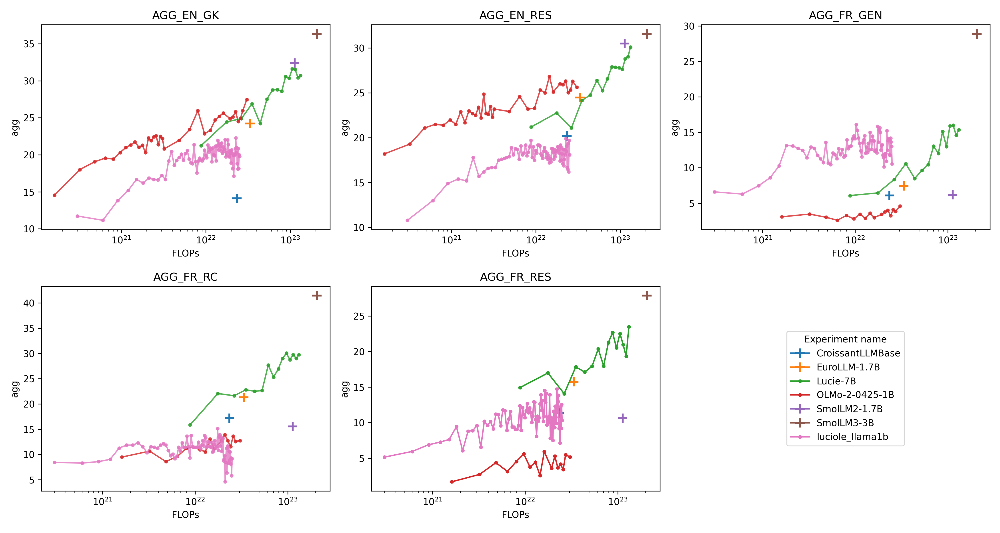
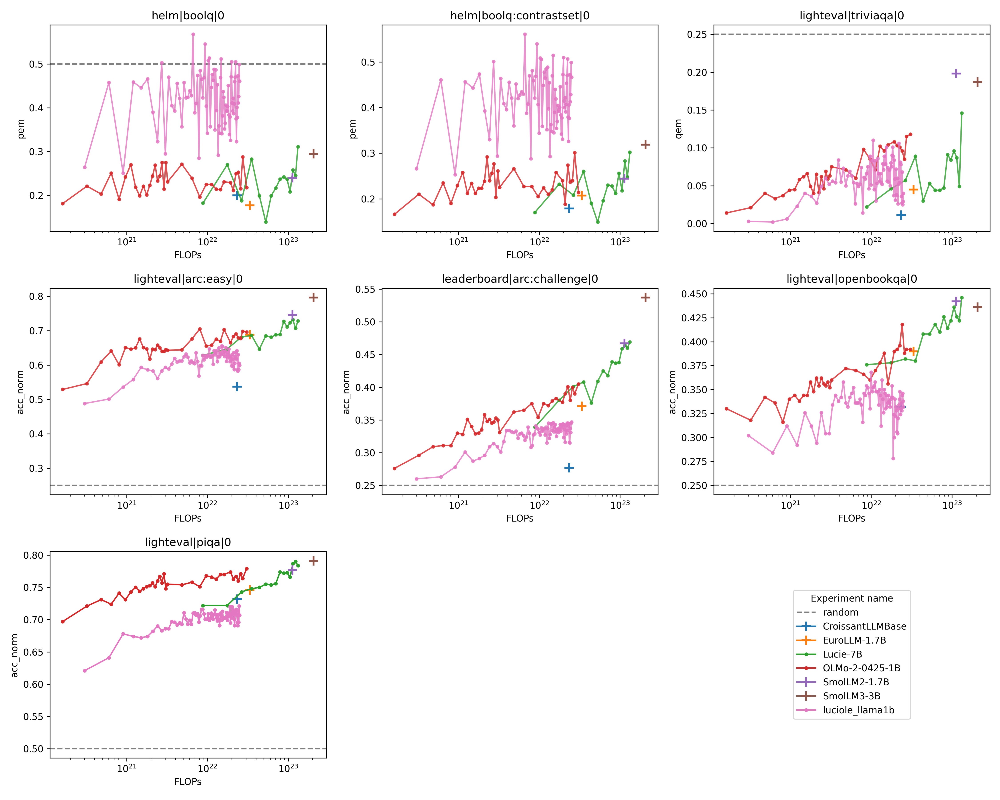
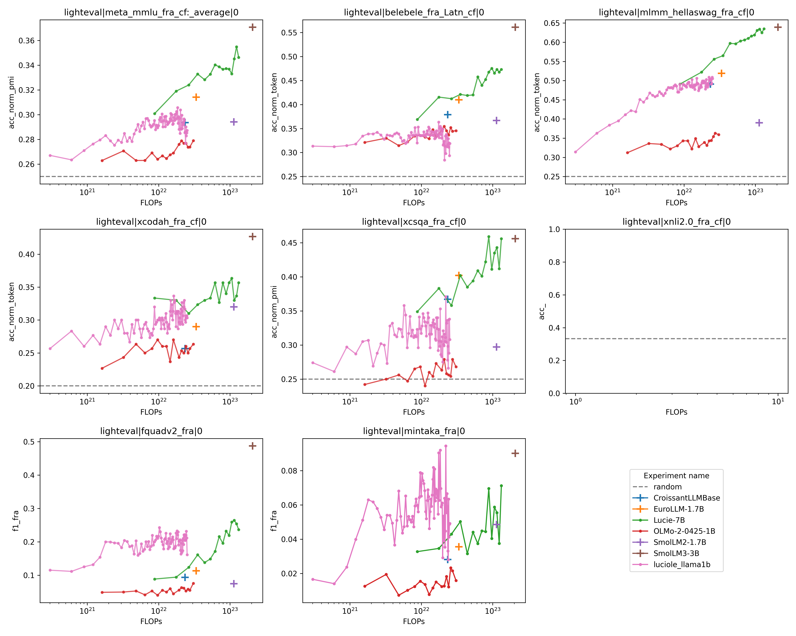

# 1B model

## Results

### Aggregated benchmarks

### English benchmarks

### French benchmarks

### Multilingual benchmarks

## Phase 1

[Repeeat](../../../data/tokenization/run/chronicles/phase_1/repeats.csv)
[Datamix](../../../data/tokenization/run/chronicles/phase_1/datamix.json)

## Phase 2

## Annealing

# 7B model

# 20 B model