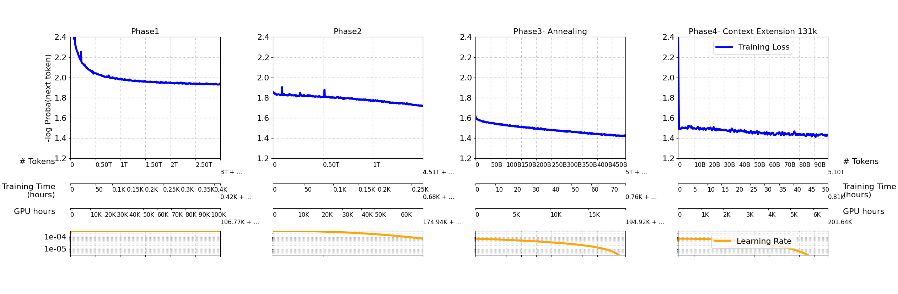
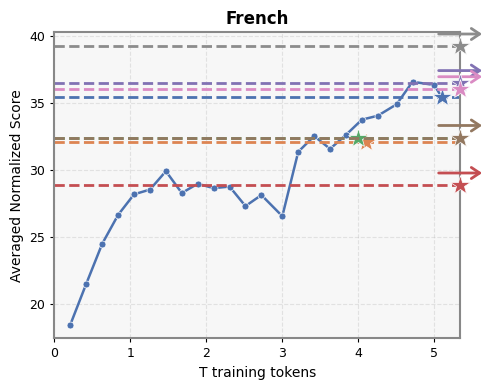
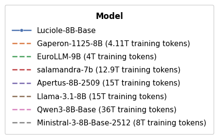
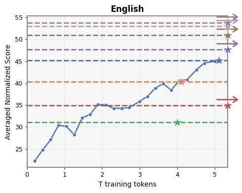
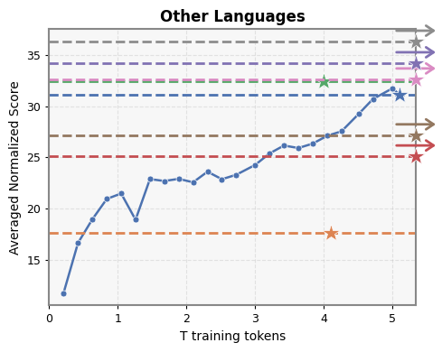
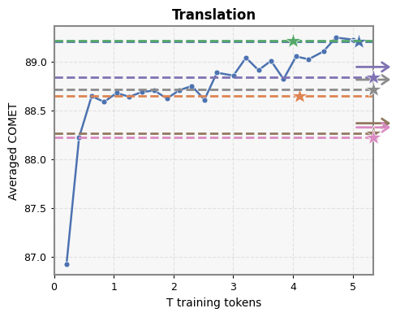
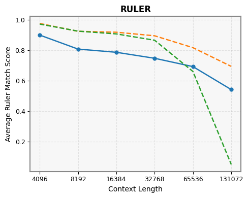

# Model Card for Luciole-8B-Base-2603

<!-- inspired from the following template:
https://github.com/huggingface/huggingface_hub/blob/main/src/huggingface_hub/templates/modelcard_template.md?plain=1
-->

* [Model Description](#model-description)
* [Uses](#uses)
* [Bias, Risks, and Limitations](#bias-risks-and-limitations)
* [Example Code in Python](#example-code-in-python)
  * [Load the model](#load-the-model)
  * [Sentence completion](#sentence-completion)
* [Loading Intermediate Checkpoints](#loading-intermediate-checkpoints)
* [Training Details](#training-details)
  * [Training Data](#training-data)
  * [Training Procedure](#training-procedure)
    * [Neural Network Architecture](#neural-network-architecture)
    * [Training Hyperparameters](#training-hyperparameters)
  * [Training Convergence and Evaluation](#training-convergence-and-evaluation)
    * [Training loss](#training-loss)
    * [Evaluation](#evaluation)
* [Citation](#citation)
* [Acknowledgements](#acknowledgements)
* [Contact](#contact)

## Model Description

Luciole-8B-Base is a pretrained 8B parameter causal language model developed by [LINAGORA](https://labs.linagora.com/) and [OpenLLM-France](https://github.com/OpenLLM-France). It was created by the consortium of the [OpenLLM France](https://openllm-france.fr/) project funded by [BPI France](https://www.bpifrance.fr/) as a part of the [France 2030](https://www.info.gouv.fr/grand-dossier/france-2030) program.

Luciole-8B-Base was trained on 5.1 trillion tokens of multilingual data, including English (41.9%), French (30.4%), German (3.8%), Spanish (3.5%), Italian (1.9%), Portuguese (1.3%), Dutch (1.0%), Arabic (0.5%), and a small subset of regional languages including regional languages of the French metropolitan area, French variants, and French creoles from around the world (0.4%). 

The latter were selected from the [FineWeb 2](https://huggingface.co/datasets/HuggingFaceFW/fineweb-2) dataset and include Basque, Breton, Catalan, Corsican, Franco-Provençal, Guadeloupean Creole French, Guianese Creole French, Occitan, Picard, Réunion Creole French, Saint Lucian Creole French, Seselwa Creole French, Tahitian, and Walloon.

Training data also include parallel data from a selection of languages (1.7%), as well as several programming languages (9.2%) and English mathematical data (3.5%).

* License: [Apache 2.0](https://www.apache.org/licenses/LICENSE-2.0)
* Training repository: [Luciole-Training](https://github.com/OpenLLM-France/Luciole-Training)
* Technical report: coming soon.


## Uses

### Direct use
Luciole-8B-Base is a foundation language model trained solely to predict the most probable next word in a sequence. It is designed as the first brick in a more complex training pipeline that would include multitask training on diverse instructions or focused fine-tuning on select downstream tasks, as well as possible alignment for human preferences.

### Downstream use 
Due to its multilingual training, Luciole-8B-Base can be fine-tuned for downstream tasks centered on the generation of multilingual text, with a special focus on French and English. 

### Out-of-Scope Use
Luciole-8B-Base is not intended to generate text directly for end use cases. It must be fine-tuned first. Its pretraining is optimized for multilingual performance, especially in French and English, and might perform less well on other languages without additional training. While trained on code data, it is not optimized for code generation tasks.

## Bias, Risks, and Limitations

Like other foundation models, Luciole-8B-Base is trained on large amounts of web data. Additionally, due to the scarcity of French textual non-web data published under open licenses, much of our French data comes from older works in the public domain that carry biases from other time periods. While we made efforts to reduce toxic and offensive content in the [Luciole Training Dataset](https://huggingface.co/datasets/OpenLLM-France/Luciole-Training-Dataset), Luciole-8B-Base may still generate such content. Filtering of the Luciole Training Dataset is an ongoing project to which we welcome contributions. 

### Recommendations
To limit the generation of undesirable content, it is advised to fine-tune Luciole-8B-Base through instruction and preference tuning (DPO, RLHF, etc.).

## Example Code in Python

### Load the model

Load the model (quantized version on GPU if possible, for efficient inference):
```python
import transformers

model_name = "OpenLLM-France/Luciole-8B-Base"

tokenizer = transformers.AutoTokenizer.from_pretrained(model_name)
model = transformers.AutoModelForCausalLM.from_pretrained(model_name,
    device_map="auto",
    load_in_4bit=True       # For efficient inference, if quantization is supported by the GPU card
)
```
### Sentence completion

Wrap the model in a text generation pipeline, and specify some generation parameters:
```
pipeline = transformers.pipeline("text-generation", model=model, tokenizer=tokenizer)

generation_kwargs = dict(
    num_return_sequences=1,               # Number of variants to generate.
    return_full_text= False,              # Do not include the prompt in the generated text.
    do_sample=True,
    temperature=1.0, top_p=1, top_k=None, # Sampling parameters.
    max_new_tokens=200,                   # Maximum length for the output text (in number of tokens).
)
```

Try 1-shot question answering:
```python
prompt = """\
Quelle est la capitale de l'Espagne ? Madrid\n\
Quelle est la capitale de la France ?\
"""
completions = pipeline(prompt, **generation_kwargs)
for completion in completions:
    print(prompt + "[…]" + completion['generated_text'])
```
This will print something like:
```
Quelle est la capitale de l'Espagne ? Madrid
Quelle est la capitale de la France ?[…] Paris
Quelle est la capitale du Brésil ? Brasilia
Quelle est la capitale de la Belgique ? Bruxelles
Quelle est la capitale de l'Italie ? Rome
...
```

<!-- If running on GPU (`cuda` device), you will need at least 6GB of VRAM to run inference using 4bit quantization (16GB of VRAM without 4bit quantization). -->

## Loading Intermediate Checkpoints

Intermediate checkpoints are released under dedicated revision tags at regular intervals throughout training:
- Every **1,000 steps** during the first **5,000 steps**  
- Then every **5,000 steps** up to **30,000 steps**  
- Then every **10,000 steps** beyond that  
- In addition, a checkpoint is provided at the **end of each training phase**

All checkpoints are available at:  
https://dl.labs.linagora.com/files/models/OpenLLM-France/Luciole-8B-Base/

They are organized into the following subfolders:
* **Phase 1 – Initial pretraining (context length: 4,096)**  
  From [phase1-step0001000](https://dl.labs.linagora.com/files/models/OpenLLM-France/Luciole-8B-Base/phase1-step0001000) to [phase1-step0715787](https://dl.labs.linagora.com/files/models/OpenLLM-France/Luciole-8B-Base/phase1-step0715787)
* **Phase 2 – Continued pretraining**  
  From [phase2-step0010000](https://dl.labs.linagora.com/files/models/OpenLLM-France/Luciole-8B-Base/phase2-step0010000) to [phase2-step0358930](https://dl.labs.linagora.com/files/models/OpenLLM-France/Luciole-8B-Base/phase2-step0358930)
* **Phase 3 – Annealing phase**  
  From [phase3-annealing-step0010000](https://dl.labs.linagora.com/files/models/OpenLLM-France/Luciole-8B-Base/phase3-annealing-step0010000) to [phase3-annealing-step0118238](https://dl.labs.linagora.com/files/models/OpenLLM-France/Luciole-8B-Base/phase3-annealing-step0118238)
* **Phase 4 – Context extension to 131k tokens**  
  [phase4-context-extension-131k-step0003000](https://dl.labs.linagora.com/files/models/OpenLLM-France/Luciole-8B-Base/phase4-context-extension-131k-step0003000) to [phase4-context-extension-131k-step0023841](https://dl.labs.linagora.com/files/models/OpenLLM-France/Luciole-8B-Base/phase4-context-extension-131k-step0023841)

The total cumulative number of training steps and training tokens for each checkpoint is specified in
the YAML header of each `README.md` file, and in
the `config.json` file (under the keys `"training_steps"` and `"training_tokens"`).

## Training Details

### Training Data

The training dataset used for the pretraining of Luciole-8B-Base is available
at [OpenLLM-France/Luciole-Training-Dataset](https://huggingface.co/datasets/OpenLLM-France/Luciole-Training-Dataset). Information on data preprocessing can be found on the data card or in the [Luciole-Training](https://github.com/OpenLLM-France/Luciole-Training) repository.
<!-- and described in ["" (2024/12)](). -->

<!-- The initial composition of the training data is as follows:-->

<!-- -->

Pretraining consisted of three principal phases of training with a context length of 4,096 tokens. The token breakdowns for the three phases are as follows:

1. Initial pretraining: 3.5 trillion tokens of diverse data
2. Continued pretraining: 1 trillion tokens introducing higher quality data and increasing math and code proportions
3. Annealing phase: 0.5 trillion tokens introducing some instruction-style and reasoning data

Pretraining was followed by one short mid-training phases to extend the context length to 131,072 tokens:

5. Context extension: 100 billion tokens to extend context length from 32,768 to 131,072 tokens

<!-- This yields the following distributions.-->

<!-- -->

### Training Procedure 

Luciole-8B-Base is a causal decoder-only model trained on a causal language modeling task (i.e., predict the next token).

It was pre-trained on 128 - 256 H100 80GB GPUs (32 - 64 nodes) for about 237,036 GPU hours (870 hours) on the [Jean Zay supercomputer](http://www.idris.fr/eng/jean-zay/jean-zay-presentation-eng.html).

The training code is available at [https://github.com/OpenLLM-France/Luciole-Training](https://github.com/OpenLLM-France/Luciole-Training). Training used version 2.3.1 of NVIDIA's [NeMo framework](https://github.com/NVIDIA-NeMo/NeMo).


<!-- Optimizer checkpoints are available at [OpenLLM-France/Lucie-7B-optimizer-states](https://huggingface.co/OpenLLM-France/Lucie-7B-optimizer-states). -->

#### Neural Network Architecture

The architecture of Luciole-8B-Base is a custom adaptation of the [NemotronH-8B](https://github.com/NVIDIA-NeMo/NeMo/blob/v2.3.1/nemo/collections/llm/recipes/nemotronh_8b.py) recipe.
It has exactly 8.08 billion free parameters,
with the following hyperparameters:
| **Hyperparameter**        | **Value** |
|---------------------------|---------|
| Vocabulary size (\# tokens)| 128,000 |
| \# blocks                 |      52 |
| \# attention heads        |      32 |
| \# key-value heads        |       8 |
| Hidden size               |   4096 |
| Intermediate size         |  21504 |
| SSM State size            |  128 |
| Mamba \# heads            |  128 |
| MLP Activation            |  `relu2`|
| Mamba Activation          |  `silu`|


#### Training Hyperparameters

The details of the intitial pretraining phase are listed below. For each subsequent phase, only the values that differ from the intitial pretraining phase are listed. 

**1. Initial pretraining**

| **Hyperparameter**     | **Value**  |
|------------------------|------------|
| Total \# samples| 732,965,888 (3T tokens) |
| Total \# steps  | 715,787  |
| Context length         | 4,096      |
| Batch size       | 1,024      |
| Learning rate schedule | Warmup (2M samples) + Constant  |
| Learning rate  | 3e-4       |
| Weight decay           | 0.1        |
| Dropout                | _          |
| Gradient clipping      | 1          |
| Initializer range      | 0.009        |
| Optimizer              | `AdamW` (β₁=0.9, β₂=0.95, ε=1e-5)    |
| Precision              | `bfloat16` |
| Tensor Parallelism (with 256 GPUs)   | 2           |
| Pipeline Parallelism (with 256 GPUs) | 1           |
| Data Parallelism (with 256 GPUs)     | 128         |

**2. Continual Pretraining**

| **Hyperparameter**     | **Value**  |
|------------------------|------------|
| Total \# samples| 367,545,344 (1.5T tokens) |
| Total \# steps  | 358,931      |
| Learning rate schedule | Cosine annealing  |
| Maximum Learning rate  | 3e-4 |
| Final Learning rate  | 6.87e-5 |


**3. Annealing**

| **Hyperparameter**     | **Value**  |
|------------------------|------------|
| Total \# samples | 121,075,712  (0.5T tokens) |
| Total \# steps  | 118,238     |
| Learning rate schedule | Linear annealing |
| Maximum Learning rate  | 6.87e-5    |
| Final Learning rate    | 0          |

**4. Context extension to 131K**

| **Hyperparameter**     | **Value**  |
|------------------------|------------|
| Total \# samples| 190,720 (25B tokens) |
| Total \# steps  | 5,960 |
| Context length         | 131,072 |
| Batch size             | 32 |
| Context Parallelism (with 128 GPUs)  | 8          |
| Tensor Parallelism (with 128 GPUs)   | 2          |
| Data Parallelism (with 128 GPUs)     | 8          |


### Training Convergence and Evaluation

#### Training loss

Information on training loss curves and training stability is available in the training logs, which are released at<br>
[metadata/training_logs](metadata/training_logs)<br>
├── [ConvergenceCurve_phase1.csv](metadata/training_logs/ConvergenceCurve_phase1.csv) -- training logs for phase 1 (initial pretraining) <br>
├── [ConvergenceCurve_phase2.csv](metadata/training_logs/ConvergenceCurve_phase2.csv) -- training logs for phase 2 (continued pretraining) <br>
├── [ConvergenceCurve_phase3-annealing.csv](metadata/training_logs/ConvergenceCurve_phase3-annealing.csv) -- training logs for phase 3 (annealing) <br>
└── [ConvergenceCurve_phase4-context-extension-131k.csv](metadata/training_logs/ConvergenceCurve_phase4-context-extension-131k.csv) -- training logs for phase 4 (context extension to 131k tokens) <br>

The following figure shows the training loss curve for the different training phases:


#### Evaluation

During the training of Luciole-8B-Base, we conducted multiple evaluations to assess performance on standard benchmarks.
The primary evaluation languages were French and English, with additional evaluations in German, Spanish, Italian, Portuguese, Dutch, and Arabic.
These evaluations were performed on intermediate checkpoints throughout training and on the final checkpoint.
We also evaluated the final checkpoint using the RULER benchmark to measure long-context performance.

For comparison, we evaluated the model against the following models, which have between 8B and 2B parameters and were trained on multilingual data, including French:
- [Gaperon-1125-8B](https://huggingface.co/almanach/Gaperon-1125-8B)
- [EuroLLM-9B](https://huggingface.co/utter-project/EuroLLM-9B)
- [salamandra-7b](https://huggingface.co/BSC-LT/salamandra-7b)
- [Llama-3.1-8B](https://huggingface.co/meta-llama/Llama-3.1-8B)
- [Apertus-8B-2509](https://huggingface.co/swiss-ai/Apertus-8B-2509)
- [Qwen3-8B-Base](https://huggingface.co/Qwen/Qwen3-8B-Base)
- [Ministral-3-8B-Base-2512](https://huggingface.co/mistralai/Ministral-3-8B-Base-2512)

The main results are summarized in the figures below.
**Click on a figure to view the complete evaluation results with detailed metrics.**
The figures illustrate the evolution of evaluation performance across training checkpoints.
The x-axis corresponds to the cumulative number of training tokens, while the y-axis reports the average performance across tasks within each category.
The RULER figure differs in that it reports average performance across different context lengths.

<table>
<tr>
<td><a href="metadata/evaluation/fr_details.png"></a></td>
<td></td>
</tr>
<tr>
<td><a href="metadata/evaluation/en_details.png"></a></td>
<td><a href="metadata/evaluation/multilingual_details.png"></a></td>
</tr>
<tr>
<td><a href="metadata/evaluation/translation_details.png"></a></td>
<td><a href="metadata/evaluation/ruler_details.png"></a></td>
</tr>
</table>

All figures can be found in the [metadata/evaluation](metadata/evaluation) folder.

## Citation

✍ Paper coming soon!


## Acknowledgements

We gratefully acknowledge BPI France for funding the OpenLLM France project under the call "Communs numériques pour l’intelligence artificielle générative" ("Digital commons for generative artificial intelligence") and the project numbers DOS0250771 and DOS0250773.

Training of Luciole-8B-Base was made possible by computing AI and storage resources by GENCI at IDRIS thanks to the grant 2024-GC011015444 on the supercomputer Jean Zay’s H100 partition. We gratefully acknowledge support from GENCI and IDRIS and from Stephane Requena (GENCI) and Pierre-François Lavallée (IDRIS) in particular. 

Luciole-8B-Base was created by members of [LINAGORA](https://labs.linagora.com/) for the OpenLLM-France project, including in alphabetical order:  

Audran Bert  
Akshay Chaturvedi  
Olivier Gouvert  
Julie Hunter  
Jean-Pierre Lorré  
Jérôme Louradour  
Charlotte Noel   
Kate Thompson   

We thank the support teams from IDRIS and NVIDIA for their technical guidance throughout the project, especially:  

Meriem Bendris (NVIDIA)  
Martin Comminges (IDRIS)  
Rémi Lacroix (IDRIS)     
Myriam Peyrounette (IDRIS)  
Hayk Shoukourian (NVIDIA)  
Oleg Sudakov (NVIDIA)  

We are also greatful to the partners of the [OpenLLM-France](https://www.openllm-france.fr/) consortium for their valuable input, with particular thanks to (in alphabetical order):  
  
Clément Bénesse (Opsci)    
Bertrand Cabot (IDRIS)  
Christophe Cerisara (LORIA)    
Liam Duignan (CEA)   
Olivier Ferret (CEA)    
Emile Hazard (OpSci)  
Léo Hunout (IDRIS)  
Gabriel Lauzzana (LORIA)      
Michel-Marie Maudet (LINAGORA)  


We would also like to thank Djamé Seddah and the GAPERON team for sharing their insights with us.

Finally, we thank the entire OpenLLM-France community, whose members have helped in diverse ways. 

## Contact

contact@openllm-france.fr
