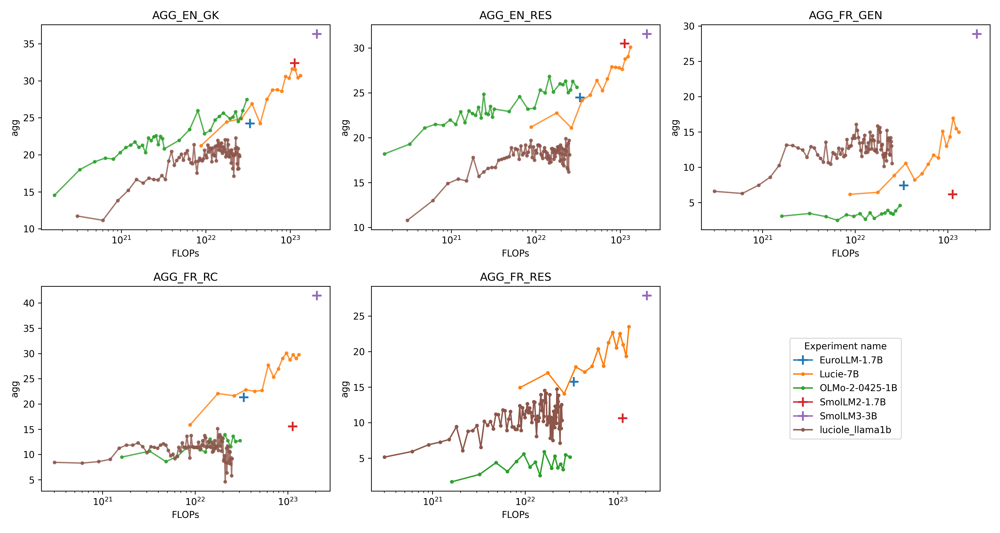
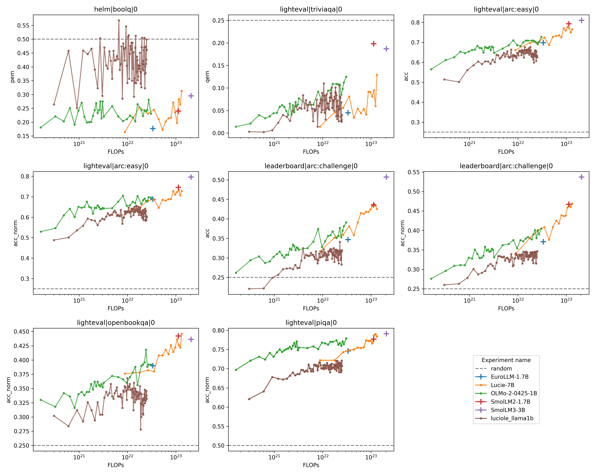
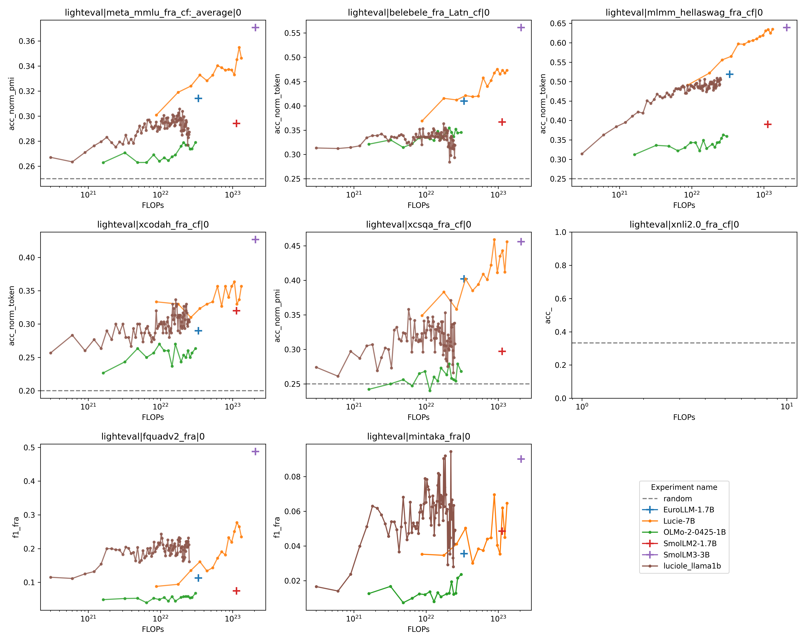

# 1B model

## Results

### Aggregated benchmarks


### English benchmarks


### French benchmarks


## Baselines

### LUCIE

Evaluate
```bash
cd evaluation/

module load anaconda-py3/2024.06
conda activate eval-env
pretrain_path=/lustre/fsn1/projects/rech/qgz/commun/OpenLLM-BPI-output/pretrain

python evaluate_experiment.py $pretrain_path/Lucie-7B --hf_model OpenLLM-France/Lucie-7B tasks/en.txt 
python evaluate_experiment.py $pretrain_path/Lucie-7B --hf_model OpenLLM-France/Lucie-7B tasks/recommended_set.txt 
python evaluate_experiment.py $pretrain_path/Lucie-7B --hf_model OpenLLM-France/Lucie-7B tasks/multilingual.txt --custom_tasks multilingual
python evaluate_experiment.py $pretrain_path/Lucie-7B --hf_model OpenLLM-France/Lucie-7B tasks/fr.txt --custom_tasks multilingual
```

### OLMO 2

Evaluate
```bash
cd evaluation/

module load anaconda-py3/2024.06
conda activate eval-env
pretrain_path=/lustre/fsn1/projects/rech/qgz/commun/OpenLLM-BPI-output/pretrain

python evaluate_experiment.py $pretrain_path/OLMo-2-0425-1B --hf_model allenai/OLMo-2-0425-1B tasks/en.txt 
python evaluate_experiment.py $pretrain_path/OLMo-2-0425-1B --hf_model allenai/OLMo-2-0425-1B tasks/recommended_set.txt 
python evaluate_experiment.py $pretrain_path/OLMo-2-0425-1B --hf_model allenai/OLMo-2-0425-1B tasks/multilingual.txt --custom_tasks multilingual
python evaluate_experiment.py $pretrain_path/OLMo-2-0425-1B --hf_model allenai/OLMo-2-0425-1B tasks/fr.txt --custom_tasks multilingual
```

### Other

Evaluate
```bash
cd evaluation/

module load anaconda-py3/2024.06
conda activate eval-env
pretrain_path=/lustre/fsn1/projects/rech/qgz/commun/OpenLLM-BPI-output/pretrain/

# EuroLLM
python evaluate_experiment.py $pretrain_path/EuroLLM-1.7B --hf_model utter-project/EuroLLM-1.7B tasks/en.txt 
python evaluate_experiment.py $pretrain_path/EuroLLM-1.7B --hf_model utter-project/EuroLLM-1.7B tasks/fr.txt --custom_tasks multilingual
python evaluate_experiment.py $pretrain_path/EuroLLM-1.7B --hf_model utter-project/EuroLLM-1.7B tasks/multilingual.txt --custom_tasks multilingual

# SmolLM2
python evaluate_experiment.py $pretrain_path/SmolLM2-1.7B --hf_model HuggingFaceTB/SmolLM2-1.7B tasks/en.txt 
python evaluate_experiment.py $pretrain_path/SmolLM2-1.7B --hf_model HuggingFaceTB/SmolLM2-1.7B tasks/fr.txt --custom_tasks multilingual
python evaluate_experiment.py $pretrain_path/SmolLM2-1.7B --hf_model HuggingFaceTB/SmolLM2-1.7B tasks/multilingual.txt --custom_tasks multilingual

# SmolLM2
python evaluate_experiment.py $pretrain_path/SmolLM3-3B --hf_model HuggingFaceTB/SmolLM3-3B tasks/en.txt 
python evaluate_experiment.py $pretrain_path/SmolLM3-3B --hf_model HuggingFaceTB/SmolLM3-3B tasks/fr.txt --custom_tasks multilingual
python evaluate_experiment.py $pretrain_path/SmolLM3-3B --hf_model HuggingFaceTB/SmolLM3-3B tasks/multilingual.txt --custom_tasks multilingual
```

## Phase 1

[Repeeat](../../../data/tokenization/run/chronicles/phase_1/repeats.csv)
[Datamix](../../../data/tokenization/run/chronicles/phase_1/datamix.json)

```bash
cd train/
python slurm_launcher.py --output_path $OpenLLM_OUTPUT/pretrain --name_prefix luciole --mode phase1 --num_nodes 128 --arch llama1b --email ogouvert@linagora.com
python slurm_launcher.py --output_path $OpenLLM_OUTPUT/pretrain --name_prefix luciole --mode phase1 --time 16:00:00 --num_nodes 128 --arch llama1b --email ogouvert@linagora.com
python slurm_launcher.py --output_path $OpenLLM_OUTPUT/pretrain --name_prefix luciole --mode phase1 --time 12:00:00 --num_nodes 128 --arch llama1b --email ogouvert@linagora.com
python slurm_launcher.py --output_path $OpenLLM_OUTPUT/pretrain --name_prefix luciole --mode phase1 --time 48:00:00 --num_nodes 64 --arch llama1b --email ogouvert@linagora.com
```

Convert
```bash
cd conversion/
pretrain_path=/lustre/fsn1/projects/rech/qgz/commun/OpenLLM-BPI-output/pretrain
sbatch convert.slurm $pretrain_path/luciole_llama1b --no_completion
python rope_scaling_correction.py 
```

Evaluate
```bash
cd evaluation/

module load anaconda-py3/2024.06
conda activate eval-env
pretrain_path=/lustre/fsn1/projects/rech/qgz/commun/OpenLLM-BPI-output/pretrain

python evaluate_experiment.py $pretrain_path/luciole_llama1b tasks/en.txt
python evaluate_experiment.py $pretrain_path/luciole_llama1b tasks/recommended_set.txt 
python evaluate_experiment.py $pretrain_path/luciole_llama1b tasks/multilingual.txt --custom-tasks lighteval.tasks.multilingual.tasks
python evaluate_experiment.py $pretrain_path/luciole_llama1b tasks/fr.txt --custom_tasks multilingual
```

Plot results
```bash
cd evaluation/

module load anaconda-py3/2024.06
conda activate eval-env
pretrain_path=/lustre/fsn1/projects/rech/qgz/commun/OpenLLM-BPI-output/pretrain
models="$pretrain_path/luciole_llama1b $pretrain_path/OLMo-2-0425-1B $pretrain_path/EuroLLM-1.7B $pretrain_path/SmolLM2-1.7B $pretrain_path/SmolLM3-3B"

python plot_results.py $models --group fr --output_path $pretrain_path/figs --seq_length 4096 --xlog 
python plot_results.py $models --group en --output_path $pretrain_path/figs --seq_length 4096 --xlog 
python plot_results.py $models --group agg --output_path $pretrain_path/figs --seq_length 4096 --xlog 
python plot_results.py $models --group fr --output_path $pretrain_path/figs --seq_length 4096 --xlog --flops
python plot_results.py $models --group en --output_path $pretrain_path/figs --seq_length 4096 --xlog --flops
python plot_results.py $models --group agg --output_path $pretrain_path/figs --seq_length 4096 --xlog --flops
```

## Phase 2

```bash
cd train/
python slurm_launcher.py --output_path $OpenLLM_OUTPUT/pretrain --name_prefix luciole --mode phase2 --num_nodes 128 --arch llama1b --email ogouvert@linagora.com
```

## Annealing

```bash
cd train/
python slurm_launcher.py --output_path $OpenLLM_OUTPUT/pretrain --name_prefix luciole --mode annealing --num_nodes 128 --arch llama1b --config datamix.json --email ogouvert@linagora.com
```

# 7B model

# 20 B model